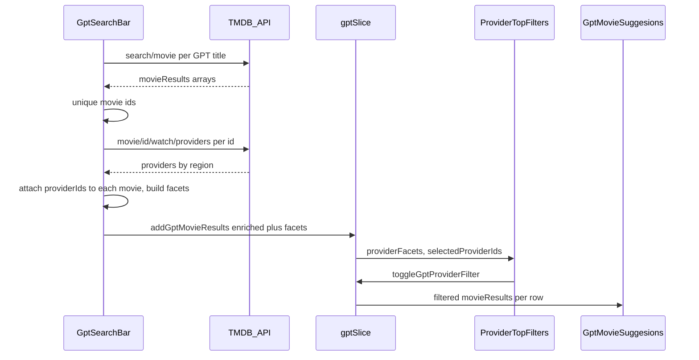
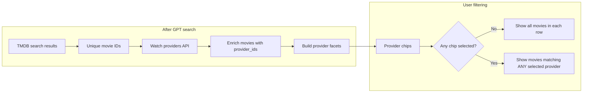

#netflix gpt

-create react app 
-configure tailwind
-Header
-Routing of App
-Login form
-Singup form
- Form valiadation
- Create Signup User Account
- Implement Sign In user Api
- Created Redux Store with userSlice
- Implemented sign out
- BugFix: sign up user displayName 
-BugFix: if the user is not logged in redirect /Browse to /Login and vice versa
- Unsubscribed  to the onAuthstatechaned callback
- Add hardcoded values to the constants file
- register tmdp api & create an app & get acess token
- get  data from tmddb now playing api
-(BONUS) Multi -language Feature in our App
-Integrate our gpt api
#features
-Login/Sign up
 - Sign In/Sign up Form
 - redirect to Browse Page
- Browse(after authentication)
  -Header
  - Main Movie
    -Trailer in Background
    -Title in Description
    -Movie list
      -MovieLists * n
-Netflix GPT
 -Search bar
 -Movie suggestoin

## TMDB watch providers and provider filters

After GPT suggests movie titles, each title is resolved via TMDB `search/movie`. Unique movie IDs from those results are enriched with **`GET /3/movie/{id}/watch/providers`**. Provider data for the configured region merges **flatrate** (subscription), **rent**, and **buy** into `provider_ids` on each movie. Facets (provider name, logo, count across unique movies) power the **Watch providers** chip row. With no chips selected, all results show; with one or more selected, each row filters to movies whose `provider_ids` intersect the selection (**OR** semantics). Movies with no providers in that region are hidden while filters are active.

**Configuration:** set `REACT_APP_TMDB_WATCH_REGION` (ISO country code, e.g. `US`, `IN`). Defaults to `US` if unset. Uses the same `REACT_APP_TMDB_KEY` / `API_OPTIONS` as other TMDB calls.

**Main files:** [`src/utils/tmdbWatchProviders.js`](src/utils/tmdbWatchProviders.js), [`src/utils/gptSlice.js`](src/utils/gptSlice.js), [`src/Components/GptSearchBar.js`](src/Components/GptSearchBar.js), [`src/Components/ProviderTopFilters.js`](src/Components/ProviderTopFilters.js), [`src/Components/GptMovieSuggesions.js`](src/Components/GptMovieSuggesions.js).

### Sequence: search → providers → store → UI

### Filter behavior (high level)

